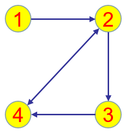
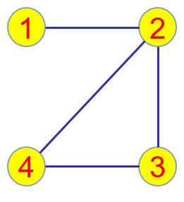

# multi-agent-system

## 参考书目

1. 复杂动态网络的同步，陆君安,刘慧,陈娟 编编著，高等教育出版社

2. 复杂网络理论及其应用，汪小帆，李翔，陈关荣编著，清华大学出版社

3. 复杂网络协调性理论，陈天平, 卢文联著，高等教育出版社

4. 网络科学导论，汪小帆，李翔，陈关荣，高等教育出版社

5. 图论

>> 注意优先次序！

## 图论

### 图的定义

- 有向图VS无向图

     

- 无向连通图
- 无向不连通图
- 有向强连通图
- 含有一个有向生成树的有向图
