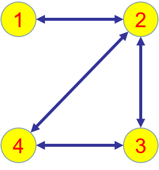
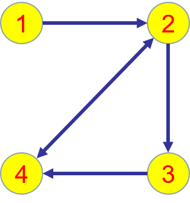
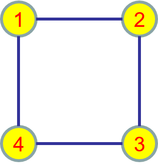
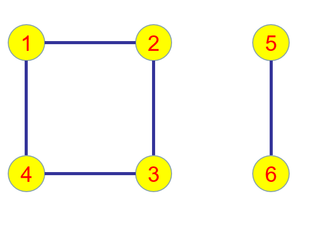

# multi-agent-system

## 参考书目

1. 复杂动态网络的同步，陆君安,刘慧,陈娟 编编著，高等教育出版社

2. 复杂网络理论及其应用，汪小帆，李翔，陈关荣编著，清华大学出版社

3. 复杂网络协调性理论，陈天平, 卢文联著，高等教育出版社

4. 网络科学导论，汪小帆，李翔，陈关荣，高等教育出版社

5. 图论

>> 注意优先次序！

## 图论

### 图的定义

- 有向图  

    

- 有向强连通图  

    

- 含有一个有向生成树的有向图  

    

- 无向图

    

- 无向连通图  

    

- 无向不连通图  

    

### 图的矩阵表示

- 图

    

- 顶点集  

    

- 边集  

    

- 邻接矩阵

    

- 拉普拉斯矩阵

    

